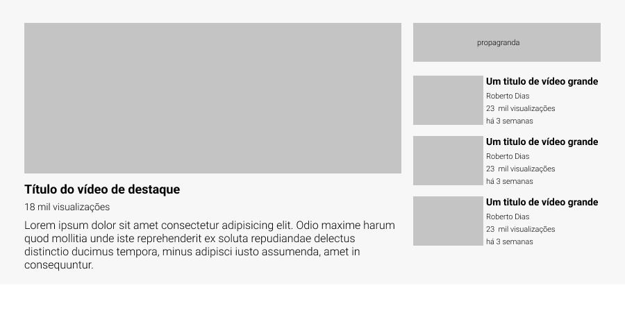
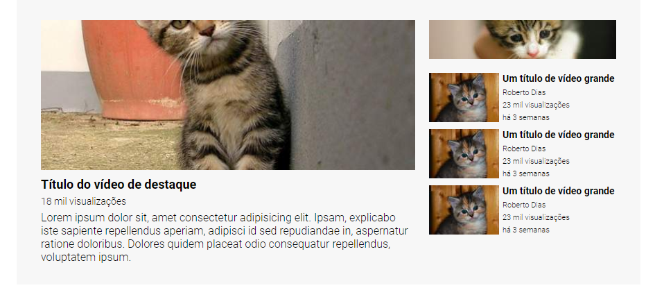

# HMTL + CSS Challenge - Youtube Layout (Grid)
## (Last Update) - 21/07/2023
### This project is a milestone of a FullStack developer course, serving to reinforce foundational principles and then upload it to a GitHub repository.

  <a href="#-technologies">Technologies</a>&nbsp;&nbsp;&nbsp;|&nbsp;&nbsp;&nbsp;
  <a href="#-project">Project</a>&nbsp;&nbsp;&nbsp;|&nbsp;&nbsp;&nbsp;
  <a href="#-layout">Layout</a>

The Project is currently accessible at:
https://bigodrigo.github.io/youtube-challenge/

## 🚀 Technologies

This project has been developed employing the following technologies:

- HTML and CSS

## 💻 Project

The Project forms a component of a series of challenges and milestones aimed at improvement throughout the course. Post-class, the students endeavour to independently replicate a particular task. In this instance, three simple exercises have been consolidated onto a single page and uploaded to GitHub.

## 🔖 Layout

    
Challenge Layout:

    

    
My Final Layout:

    

